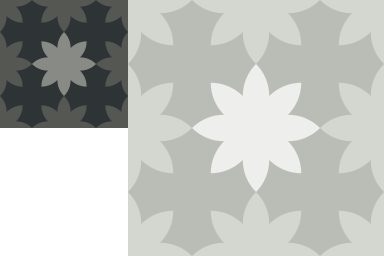
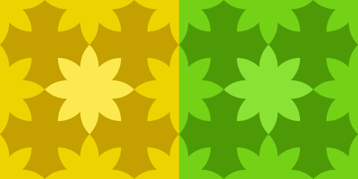
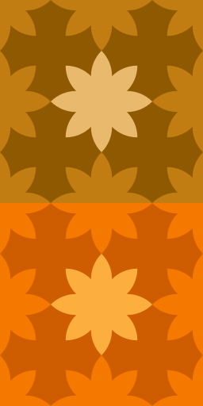
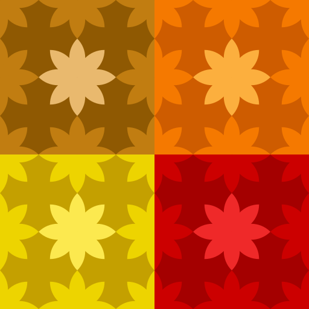
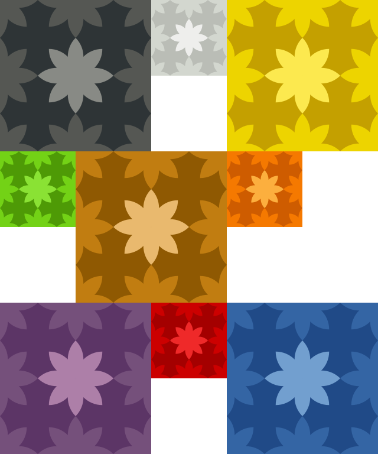

# Python Image Merger

A Python image merging script.

## Dependencies

This script uses [Pillow](https://pillow.readthedocs.io/en/stable/index.html#) for image manipulation. Please [install Pillow](https://pillow.readthedocs.io/en/stable/installation.html) before using this script.

## Usage

```python
python ImageMerger.py "--orientation=v" "--size=2" "--mode=RGB" "--fill-color=rgb(255,255,255)" "--optimize=t" "--quality=100" --verbose "--merge-path=test_files/output/test_2_vertical.png" "test_files/128/orange.png" "test_files/256/scarlet_red.png"
```

- `--orientation=[str]`: Include if you want the merge to happen horizontally (`h`) or vertically (`v`). You can place any text here, but it will only check the first letter to mach either `h` or `v`, ignoring capitalization. If the first letter does not match either option, it will fall back to the default. Default is `h`.
- `--size=[int]`: The number of images to fit along the width/height of the final image before changing row/column. Default is `0` (never changes the row/column).
- `--mode=[str]`: A string defining the type and depth of the pixels in the final image. Refer to [Pillow modes](https://pillow.readthedocs.io/en/stable/handbook/concepts.html#concept-modes) for all possible options. Default is `RGBA`.
- `fill-color=[str]`: A string defining the final image's background color (only visible when images have mismatched sizes, or there are not enough images to fill the final row/column). Refer to [Pillow color names](https://pillow.readthedocs.io/en/stable/reference/ImageColor.html#color-names) for all possible options. Default is full transparency (`rgba(0, 0, 0, 0)` / `#00000000`).
- `--optimize=[str]`: A string defining if you want the final image to have [optimized encoder settings](https://pillow.readthedocs.io/en/stable/handbook/image-file-formats.html#png) (`t` / `y`) or not (`f` / `n`). You can place any text here, but it will only check the first letter to mach either `t`, `y`, `f`, or `n`, ignoring capitalization. If the first letter does not match either option, it will fall back to the default. Default is to optimize (`t` / `y`).
- `--quality=[int]`: An int defining the level of quality of the final image, ranging from `0` (worst) to `100` (best). Will only work on certain types of images, such as JPEG and TIFF. Default is `75`.
- `--verbose`: Include if you want the program to output to the console the value of all setup variables.
- `--merge-path=[str]`: The path where to store the final merged image, relative to the current running directory. If no value is provided, it will output the merge to `merge.png` at the current working directory.

Every image path (relative to the current running directory) listed after these arguments will add the corresponding image in that order to the final image.

## Output Examples











